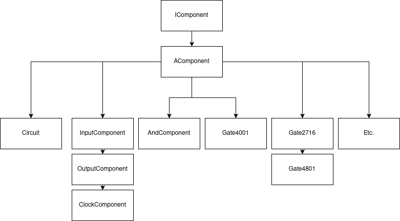
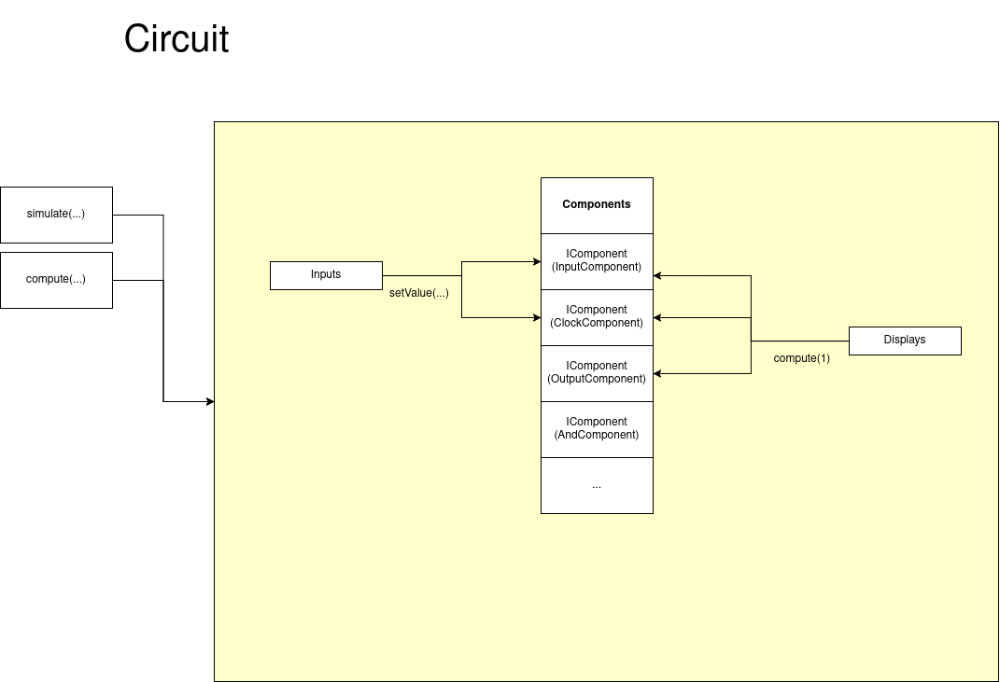

# Nanotekspice

## Project Rules Compilation

### Prerequisites
Before you begin, make sure you have the following installed:
- A C++ compiler (such as `g++` or `clang++`).
- The `make` utility installed on your machine.

### Project Structure
The project typically contains a `Makefile`, which defines the rules for compiling and generating the executable.

### Compile
In the terminal, navigate to the project directory and run the following command to build it :

```bash
make
```

### Clean
In order to delete the build files, run :

```bash
make clean
```

In order to delete the build and temporaries files, run :

```bash
make fclean
```

## Project Usage
In a terminal, run this command to launch the program :

```bash
./nanotekspice <file.nts>
```

You must give a file that contains all the informations for a component (or multiple components asschemin/vers/l'image.pngembly)

## Architecture

Here, you can discover a quick synthetic schematic to understand how the project is designed.





## Project Expensions

To add a component in the project, follow the steps outlined below. This guide will help you implement the component with an optional constructor for initializing unique variables, as well as the necessary functions for computation and simulation.

### 1. Define the Component Class

Start by defining your component class. This will include the necessary member variables and functions. The class will need an optional constructor to initialize any unique variables, the compute function to return the value of the pin, and the simulate function to perform calculations and update the stored value on each tick.

### 2. Optional Constructor Initialization

In the Component class, the constructor is defined and can call a file or initialize a storage value.

### 3. Compute Function

The compute() function simply returns the current value of the pin. You can modify this function to return more complex calculations.

### 4. Simulate Function

The simulate() function is used to perform calculations at each tick. It can update the current value if it depends of the tick (based on the clock input), perform calculations or write in a file.
